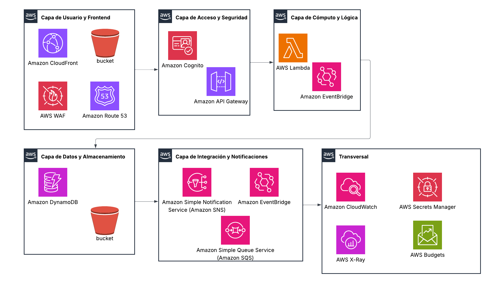

**Arquitectura**

{width="5.905555555555556in"
height="3.4159722222222224in"}

Esta Arquitectura de Referencia (alto nivel) describe un sistema
serverless moderno en AWS, optimizado para escalabilidad, seguridad y
eficiencia de costos.

A continuación, el desglose de los componentes clave, decisiones
técnicas y medidas de seguridad:

**Arquitectura**

**Capa de Usuario y Frontend:**

-   **Route 53:** Gestiona el dominio y dirige el tráfico.

-   **CloudFront (CDN) + ACM:** Entrega el contenido estático de forma
    segura (HTTPS).

-   **WAF:** Protege el punto de entrada (CloudFront/API Gateway).

-   **S3 (Bucket):** Aloja los archivos del frontend estático.

**Capa de Acceso y Seguridad:**

-   **Amazon Cognito:** Maneja el inicio de sesión y entrega
    un **JWT** al cliente.

-   **API Gateway:** Recibe peticiones del frontend y usa un **Cognito
    Authorizer** para validar el token.

**Capa de Cómputo y Lógica:**

-   **AWS Lambda:** Ejecuta la lógica de negocio (con CodeDeploy para
    despliegues blue/green).

-   **EventBridge:** Actúa como el bus de eventos central para
    desacoplar procesos.

**Capa de Datos y Almacenamiento:**

-   **DynamoDB:** Base de datos NoSQL para persistencia rápida.

-   **S3 (Bucket Privado):** Almacena archivos y evidencias, accesibles
    solo mediante Presigned URLs.

**Capa de Integración y Notificaciones:**

-   **SNS/SES:** Para enviar correos o notificaciones de confirmación.

-   **SQS (DLQ):** Cola para capturar y reintentar mensajes fallidos.

-   **EventBridge Scheduler:** Dispara tareas programadas
    (recordatorios).

**Transversal (Observabilidad y Gobernanza):**

-   **CloudWatch & X-Ray:** Monitoreo y trazado de peticiones.

-   **Secrets Manager:** Almacenamiento seguro de credenciales.

-   **AWS Budgets:** Control de costos basado en etiquetas.

**Decisiones de Diseño**

**Frontend desacoplado:** Se opta por S3 + CloudFront, lo que permite
una entrega de contenido estático global con baja latencia y alta
disponibilidad sin gestionar servidores.

**Backend Serverless:** El uso de AWS Lambda para cómputo y Amazon API
Gateway (REST) elimina la carga operativa de infraestructura. La
decisión de usar Lambda Aliases y CodeDeploy permite despliegues seguros
tipo blue/green.

**Persistencia de Datos:** Utiliza DynamoDB con un diseño de tabla única
(Single Table Design) empleando PK/SK (Partition/Sort Keys) y GSI
(Global Secondary Indexes). Esto maximiza el rendimiento y minimiza los
costos para patrones de acceso conocidos.

**Arquitectura Orientada a Eventos (EDA):** EventBridge es el núcleo
para orquestar flujos de trabajo de forma asíncrona, desacoplando
servicios mediante la emisión de eventos específicos (WORKSHOP_CREATED,
etc.).

**Manejo de Archivos:** Los archivos privados se protegen en S3,
permitiendo el acceso controlado mediante Presigned URLs, evitando que
los archivos sean públicos por defecto.

**Estrategia de Seguridad**

La seguridad se implementa en múltiples capas siguiendo las mejores
prácticas de AWS:

  -----------------------------------------------------------------------
                     **Herramientas y Estrategias**
  ------------------ ----------------------------------------------------
  Identidad y Acceso Amazon Cognito para gestión de usuarios; IAM bajo el
                     principio de \"mínimo privilegio\"
                     (least-privilege).

  Perímetro          AWS WAF integrado con CloudFront y API Gateway para
                     protección contra ataques web (SQLi, XSS).

  Autorización       Validación de rutas protegidas mediante Cognito JWT
                     Authorizer en el API Gateway.

  Protección de      Uso de ACM para cifrado TLS en tránsito; Secrets
  Datos              Manager para rotación y almacenamiento seguro de
                     credenciales.

  Resiliencia        Implementación de colas SQS DLQ (Dead Letter Queues)
                     para manejar y reintentar fallos en el
                     procesamiento.
  -----------------------------------------------------------------------
